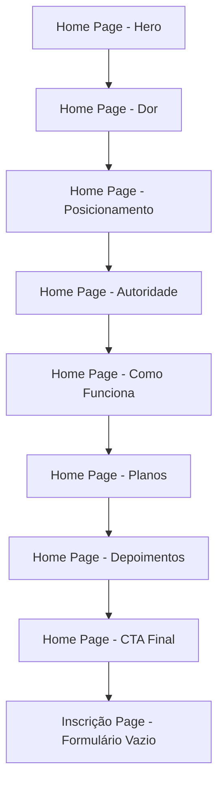

## 1. Product Overview
Atualização da landing page existente do site Teacher Samira Nunes para uma nova estrutura focada em conversão, mantendo identidade visual atual (fotos e cores), com adição de página de inscrição vazia.

- **Objetivo:** Transformar landing page atual em estrutura de alta conversão com formulário de aplicação
- **Público:** Profissionais e adultos buscando inglês premium/personalizado
- **Valor:** Aumentar taxa de conversão mantendo consistência visual

## 2. Core Features

### 2.1 User Roles
| Role | Registration Method | Core Permissions |
|------|---------------------|------------------|
| Visitante | N/A | Visualizar conteúdo, acessar formulário de inscrição |
| Lead | Preencher formulário de inscrição | Receber contato via WhatsApp |

### 2.2 Feature Module
Landing page atualizada consiste nas seguintes seções principais:
1. **Hero Section:** Headline de conversão, subheadline e CTA principal
2. **Seção de Dor:** Identificação de problemas com checklist interativo
3. **Seção de Posicionamento:** Virada de chave sobre segurança vs perfeição
4. **Seção Quem é Samira:** Autoridade humanizada com formação e filosofia
5. **Seção Como Funcionam as Aulas:** Estrutura e diferenciais
6. **Seção Planos:** Tabela de planos de acompanhamento
7. **Seção Resultados:** Prova social mantendo depoimentos existentes
8. **Formulário de Inscrição:** CTA final com redirecionamento para página dedicada
9. **Página de Inscrição:** Nova página vazia para implementação futura

### 2.3 Page Details
| Page Name | Module Name | Feature description |
|-----------|-------------|---------------------|
| Home Page | Hero Section | Exibir headline "Fale inglês com segurança", subheadline sobre aulas personalizadas, CTA "Quero me inscrever" com scroll para formulário |
| Home Page | Dor Section | Listar 5 situações problemáticas com checkbox interativo, texto explicativo sobre pressão/medo/direcionamento |
| Home Page | Posicionamento | Texto sobre segurança vs perfeição, construção de confiança com acompanhamento |
| Home Page | Autoridade | Bio com 14 anos experiência, formações Letras/Pós/MBA/Certificações, filosofia de ensino |
| Home Page | Como Funciona | Aulas individuais Zoom 50min, material didático, gravação, suporte WhatsApp, professora IA 24h |
| Home Page | Planos | Tabela com 4 planos: Start(1x), Fluency(2x), Intensive(3x), Immersion(4x) |
| Home Page | Depoimentos | Manter depoimentos existentes do index.html atual |
| Home Page | CTA Final | Botão redirecionando para página de inscrição com aviso vagas limitadas |
| Inscrição Page | Formulário Vazio | Página vazia preparada para implementação futura de formulário |

## 3. Core Process
**Fluxo do Visitante:**
1. Usuário acessa landing page
2. Visualiza hero section com CTA principal
3. Percorre seções de dor, posicionamento e autoridade
4. Conhece planos e diferenciais
5. Visualiza depoimentos sociais
6. Clica em CTA final "Quero me inscrever"
7. Redirecionado para página dedicada de inscrição
8. Página de inscrição exibe aviso sobre implementação futura

## 4. User Interface Design

### 4.1 Design Style
- **Cores:** Manter esquema de cores atual do index.html (cores claras, tons profissionais)
- **Fontes:** Manter fonte Cambria do site atual
- **Botões:** Estilo atual com hover effects, CTA principal em destaque
- **Layout:** Estrutura de página única com scroll, manter estilo de cards existente
- **Imagens:** Reutilizar fotos atuais em assets/persona e products

### 4.2 Page Design Overview
| Page Name | Module Name | UI Elements |
|-----------|-------------|-------------|
| Home Page | Hero Section | Background clean, headline em fonte grande, CTA button primary color, scroll indicator |
| Home Page | Dor Section | Checkboxes customizados, texto em coluna centralizada, fundo alternativo para destaque |
| Home Page | Autoridade | Foto Samira + texto lado a lado, badges de certificações, layout responsivo |
| Home Page | Planos | Tabela comparativa com 4 colunas, highlight no plano mais popular, cores consistentes |
| Home Page | Depoimentos | Grid de cards mantendo estilo atual, avatares, links para vídeos |
| Inscrição Page | Container Vazio | Container centralizado com mensagem temporária, manter header/footer |

### 4.3 Responsiveness
- Desktop-first approach mantendo estrutura atual
- Mobile adaptive com menu hamburger existente
- Touch optimization para checkboxes e CTAs
- Imagens responsivas mantendo proporções

### 4.4 Assets Preservation
- **Fotos:** Reutilizar todas em assets/persona/
- **Logos:** Manter logo-white.png no header/footer
- **Depoimentos:** Manter avatares e estrutura existente
- **Produtos:** Manter imagens de livros e cursos