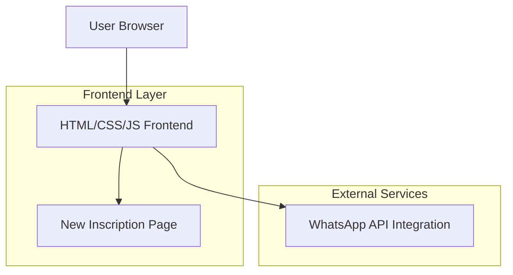

## 1. Architecture design



## 2. Technology Description
- Frontend: HTML5 + CSS3 + Vanilla JavaScript
- Build Tool: None (static site)
- Backend: None (client-side only)
- External Services: WhatsApp API for CTAs

## 3. Route definitions
| Route | Purpose |
|-------|---------|
| /index.html | Landing page principal com nova estrutura de conversão |
| /inscricao.html | Página de inscrição vazia para implementação futura |

## 4. File Structure Changes
```
x:\ATDEV\samira\samiranunesteacher\
├── index.html (atualizado com nova estrutura)
├── inscricao.html (nova página vazia)
├── styles.css (atualizado com novas seções)
├── script.js (atualizado com interações)
└── assets/ (mesma estrutura - reutilizar existente)
    ├── logos/
    ├── persona/
    ├── products/
    └── avatar/
```

## 5. JavaScript Interactions
### 5.1 Checklist Interativo (Seção Dor)
```javascript
// Checkbox interaction for pain points
const checkboxes = document.querySelectorAll('.pain-checkbox');
checkboxes.forEach(checkbox => {
    checkbox.addEventListener('change', function() {
        // Update progress or show message
        updatePainChecklist();
    });
});
```

### 5.2 Smooth Scroll para CTA
```javascript
// Smooth scroll to form section
document.querySelector('.cta-button').addEventListener('click', function() {
    document.querySelector('#formulario').scrollIntoView({ 
        behavior: 'smooth' 
    });
});
```

### 5.3 Redirecionamento para Inscrição
```javascript
// Redirect to inscription page
document.querySelector('.final-cta').addEventListener('click', function() {
    window.location.href = '/inscricao.html';
});
```

## 6. CSS Requirements
### 6.1 New Section Styles
```css
/* Hero section with conversion focus */
.hero-conversion {
    background: linear-gradient(135deg, #667eea 0%, #764ba2 100%);
    color: white;
    text-align: center;
    padding: 100px 20px;
}

/* Pain checklist section */
.pain-checklist {
    background-color: #f8f9fa;
    padding: 80px 20px;
}

.pain-item {
    display: flex;
    align-items: center;
    margin: 15px 0;
    font-size: 18px;
}

/* Plans table */
.plans-table {
    display: grid;
    grid-template-columns: repeat(auto-fit, minmax(250px, 1fr));
    gap: 20px;
    margin: 40px 0;
}

.plan-card {
    border: 2px solid #e0e0e0;
    border-radius: 10px;
    padding: 30px;
    text-align: center;
    transition: transform 0.3s ease;
}

.plan-card:hover {
    transform: translateY(-5px);
    box-shadow: 0 10px 30px rgba(0,0,0,0.1);
}
```

## 7. WhatsApp Integration
Manter integração existente com número atual:
```html
<a href="whatsapp://send/?phone=5533998009249&text=Quero+agendar+uma+aula+!" class="btn-whatsapp">
    👉 Quero agendar meu diagnóstico
</a>
```

## 8. Responsive Design
- Mobile-first approach com breakpoints existentes
- Manter menu hamburger atual
- Adaptar tabela de planos para mobile (stack vertical)
- Checkboxes otimizados para touch

## 9. Performance Considerations
- Reutilizar todas imagens existentes para evitar novos downloads
- Manter CSS e JS minificados
- Lazy loading para imagens fora do viewport inicial
- Manter estrutura de cache existente

## 10. SEO Preservation
- Manter meta tags existentes
- Preservar schema markup atual
- Manter URL amigável existente
- Preservar estrutura de headings (h1, h2, etc)